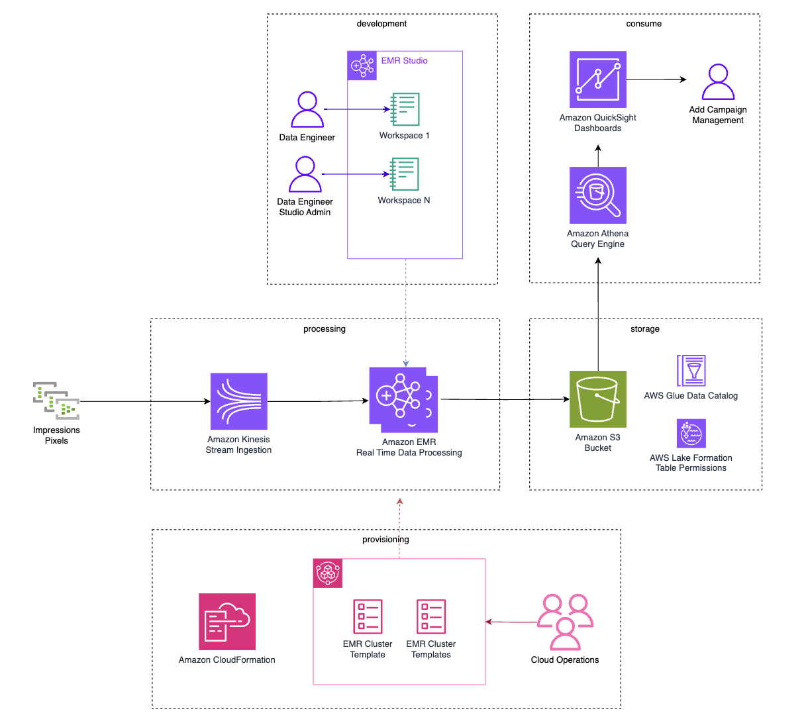

# Big Data Analytics Development Platform with Amazon EMR Studio

## Table of Contents

1. [Overview](#overview)
    - [Contents](#contents)
    - [Architecture Overview](#architecture-overview)
    - [CloudFormation Templates](#cloudformation-templates)
    - [Cost](#cost)
2. [Prerequisites](#prerequisites)
    - [AWS Account Requirements](#aws-account-requirements)
    - [Operating System](#operating-system)
3. [Deployment Steps](#deployment-steps)
4. [Deployment Validation](#deployment-validation)
5. [Running the Guidance](#running-the-guidance)
6. [Next Steps](#next-steps)
7. [Cleanup](#cleanup)
8. [FAQ, known issues, additional considerations, and limitations](#faq-known-issues-additional-considerations-and-limitations)
9. [Revisions](#revisions)
10. [Notices](#notices)
11. [Authors](#authors)

## Overview

This guidance is for creating a self-service analytics platform on [Amazon EMR Studio](https://aws.amazon.com/emr/features/studio/). 
Data science and data engineering teams can self-provision EMR clusters on demand for interactive development of stream 
and batch processing workloads with Apache Spark.

### Contents
The following table lists and describes the files in this repo:

| #  | File Name                                               | Description                                                                                                                                                                 |
|:--:|:--------------------------------------------------------|:----------------------------------------------------------------------------------------------------------------------------------------------------------------------------|
| 1. | [deployment/templates/emr-cluster-template-for-service-catalog.yaml](./deployment/templates/emr-cluster-template-for-service-catalog.yaml) | Sample cluster template for AWS Service Catalog for self service deployment via Amazon EMR Studio GUI.                                                                      |
| 2. | [deployment/templates/emr-kinesis-data-stream.yaml](./deployment/templates/emr-kinesis-data-stream.yaml)                  | AWS Cloudformation template to deploy a Kinesis Data Stream for data ingestion.                                                                                             |
| 3. | [deployment/templates/emr-studio-setup.yaml](deployment/templates/emr-studio-setup.yaml)                         | Template to deploy an EMR Studio Workspace and the necessary infrastucture to support a self-service big data analytics environment with EMR.                               |
| 4. | [deployment/templates/emr-studio-iam-setup.yaml](deployment/templates/emr-studio-iam-setup.yaml)                     | Creates the Amazon EMR studio service role and an EMR Studio Admin Role. The template is referenced by the emr-studio-setup.yaml template.                                  |
| 5. | [deployment/templates/emr-studio-network-setup.yaml](deployment/templates/emr-studio-network-setup.yaml)                 | Deploys an Amazon VPC and basic network configuration to deploy an EMR cluster in 2 availability zones. The template is referenced by the emr-studio-setup.yaml template.   |
| 6. | [deployment/templates/emr-studio-service-catalog-setup.yaml](deployment/templates/emr-studio-service-catalog-setup.yaml)         | Template to deploy the sample cluster template as a service catalog product. The template is referenced by the emr-studio-setup.yaml template.                              |
| 7. | [deployment/templates/emr-studio-transform-lambda.yaml](deployment/templates/emr-studio-transform-lambda.yaml)              | AWS Cloudformation template to deploy a Transform and an AWS Lambda Function macro. The template is referenced by the emr-studio-setup.yaml template.                       |
| 8. | [source/notebooks/realtime-impression-tracking.ipynb](./source/notebooks/realtime-impression-tracking.ipynb)            | EMR notebook with sample code for a real time ad impressions processing use case with with Spark Structure Streaming and a data lake in AWS S3 using Apache Iceberg Tables. |
| 9. | [source/scripts/](deployment/scripts/)*                                               | Shell command scripts to help with build process.                                                                                                                           |


### Architecture Overview

_Sample Architecture Diagram for Real-Time Streaming_



### CloudFormation Templates

The [AWS CloudFormation](https://aws.amazon.com/cloudformation/) templates in this repo deploy an Amazon EMR Studio 
environment with a sample [Amazon EMR](https://aws.amazon.com/emr/) cluster template hosted in 
[AWS Service Catalog](https://aws.amazon.com/servicecatalog/) that can be deployed via AWS EMR Studio. 

Also within this repo we provide sample code within an EMR notebook referencing a real-time ad impressions processing 
use case using Spark Structure Streaming within EMR to ingest data from an 
[Amazon Kinesis Data Stream](https://aws.amazon.com/kinesis/data-streams/) to populate a data lake in Amazon S3.

Users can self provision an EMR Cluster using the sample templates that help abstract the configuration of the cluster 
into three simple questions: 

1. **User Concurrency** - *What is the expected user concurrency in the environment?* 
This will help determine the node count for the EMR cluster by provisioning 10 executors per user. 
2. **Memory Profile** - *What are the memory expectations of the workload (Small, Medium, Large)*?. 
This parameter determines the instance types for the cluster nodes.  The instance type determines the CPU and memory 
provisioned to each Spark Executor. The sample templates provisions m7g instances for small, and r7g for medium and large.
3. **Optimization** - *Does the workload have specific SLAs to meet? then optimize for reliability. If SLAs are flexible 
choose to optimize for Cost*. This option will determine if the task nodes can leverage AWS Spot instances or only On-Demand instances.

In order to resolve the size configurations from these abstract input values, the template is using AWS CloudFormation 
features including Mappings, Conditions and an [AWS Lambda](https://aws.amazon.com/lambda/) Transform. The provisioning 
logic can be customized by modifying the template sample "emr-cluster-template-for-service-catalog.yaml" template and 
deploying as a new product in the AWS service catalog or registering as a new version.

The AWS CloudFormation templates deploy network, security and Amazon EMR Studio components. The EMR Studio environment leverages 
[AWS Identity and Access Management (IAM)](https://aws.amazon.com/iam/) permissions. The template configurations 
(e.g. subnet ID, VPC, etc.) are exported into AWS CloudFormation attributes that can be referenced via the sample 
cluster template. This allows cloud operations teams to hide and abstract this elements from end users 
(e.g. Data Engineers, Data Scientist) for ease of use.  Cloud Operations teams can leverage their own network 
configuration and publish a new  cluster template that references the required parameters.

### Cost

_You are responsible for the cost of the AWS services used while running this Guidance. As of March 2024, the cost for running this Guidance with the default settings in the us-west-2 (Oregon) region with a constant stream of data is approximately $1,248 USD per month. This link to the [AWS Pricing Calculator](https://calculator.aws/#/estimate?id=077817c99b51c4812c6dc4986d921dbe3fa22f85) shows the cost breakdown of all the services and uses the "small" EC2 instance profile for the EMR cluster._

## Prerequisites

### AWS Account Requirements
You will need a non-production AWS Account in which you have privileges to launch CloudFormation stacks.

### Operating System
To execute any of the CLI commands referenced in this guidance, you can install the AWS CLI using these instructions. [Install or update to the latest version of the AWS CLI](https://docs.aws.amazon.com/cli/latest/userguide/getting-started-install.html).

## Deployment Steps

### 1. Deploy EMR Studio Environment

Deploy the EMR Studio Environment using the AWS CloudFormation template 'emr-studio-setup.yaml' in your AWS Account.

[](https://us-west-2.console.aws.amazon.com/cloudformation/home?region=us-west-2#/stacks/create/review?templateURL=https://s3.us-west-2.amazonaws.com/emrstudio.sample.templates/templates/emr-studio-setup.yaml&stackName=analytics-with-emr)


   - The AWS CloudFormation template takes as input parameter the ARN of the role or user that can assume the EMR Studio Admin
   role. Follow [these instructions](https://repost.aws/questions/QUcpdKB-EhTGu81lKWEdpArg/where-can-i-find-my-iam-arn) to 
   find your user's ARN.  Or use the following AWS CLI commands to get the ARN of the IAM user.

       ```
       aws iam get-user \
       --user-name <username>
    
       aws iam get-role \
       --role-name <role name>
       ```

   - As an alternative to launching the stack in the AWS Console, you can use the following AWS CLI Command. Make sure to update the IAM user ARN and the region before executing. This template has been tested in the us-east-1 and 
   us-west-2 regions.

       ```
       aws cloudformation create-stack \
       --stack-name "analytics-with-emr" \
       --template-body file://deployment/templates/emr-studio-setup.yaml \
       --capabilities CAPABILITY_NAMED_IAM \
       --parameters ParameterKey=IAMUserArn,ParameterValue=<your IAM user ARN> \
       --region us-west-2
       ```

### 2. Deploy EMR Cluster Template in AWS Service Catalog

1. Create EMR cluster key pair following [these instructions.](https://docs.aws.amazon.com/AWSEC2/latest/UserGuide/create-key-pairs.html)

2. Deploy the EMR cluster product in AWS Service Catalog with the AWS CloudFormation template 
emr-studio-service-catalog-setup.yaml. 

[](https://us-west-2.console.aws.amazon.com/cloudformation/home?region=us-west-2#/stacks/create/review?templateURL=https://s3.us-west-2.amazonaws.com/emrstudio.sample.templates/templates/emr-studio-service-catalog-setup.yaml&stackName=emr-service-catalog-product)

   - The template takes as parameters the name of the key pair created 
   in step 2.  
   - Or use the following AWS CLI Command. Update the key pair name and region 
   parameter values before executing the following AWS CLI command.

       ```
       aws cloudformation create-stack \
       --stack-name "emr-service-catalog-product" \
       --template-body file://deployment/templates/emr-studio-service-catalog-setup.yaml \
       --parameters ParameterKey=DefaultSSHKey,ParameterValue=<your key pair name> \
       --capabilities CAPABILITY_NAMED_IAM \
       --region us-west-2
       ```

### 3. Deploy Kinesis Stream and Kinesis Data Generator

1. Launch a Kinesis Data Stream using the 'emr-kinesis-data-stream.yaml' AWS cloudformation template:

[](https://us-west-2.console.aws.amazon.com/cloudformation/home?region=us-west-2#/stacks/create/review?templateURL=https://s3.us-west-2.amazonaws.com/emrstudio.sample.templates/templates/emr-kinesis-data-stream.yaml&stackName=emr-kinesis-stream)

2. Deploy the Kinesis Data Generator to simulate streaming events using [these instructions.](https://awslabs.github.io/amazon-kinesis-data-generator/web/help.html) Use the following content for the Kinesis Data Generator Record Template.

```
## Sample Pixel Payload
{        
"event_time": "{{date.now}}",
"action_source": "WEBSITE",
"action_source_url": "www.example.com",        
"user_data": {        
"ipsrc": "{{random.arrayElement(
["a5b50a8b-3a77-4f83-aff4-68aa167f7c67", "b5b50a8b-3a77-4f83-aff4-68aa167f7c63","c5b50a8b-3a77-4f83-aff4-68aa167f7c62","d5b50a8b-3a77-4f83-aff4-68aa167f7c65"]
)}}",        
"vmcid": "{{random.arrayElement(
["a5b50a8b-3a77-4f83-aff4-68aa167f7c67", "b5b50a8b-3a77-4f83-aff4-68aa167f7c63","c5b50a8b-3a77-4f83-aff4-68aa167f7c62","d5b50a8b-3a77-4f83-aff4-68aa167f7c65"]
)}}",
"email": "{{random.arrayElement(
["a5b50a8b-3a77-4f83-aff4-68aa167f7c67", "b5b50a8b-3a77-4f83-aff4-68aa167f7c63","c5b50a8b-3a77-4f83-aff4-68aa167f7c62","d5b50a8b-3a77-4f83-aff4-68aa167f7c65"]
)}}",
"region": "{{random.arrayElement(["AL","AK","AZ","AR","CA","CO","CT","DE","FL","GA","HI","ID","IL","IN","IA","KS","KY","LA","ME","MD","MA","MI","MN","MS","MO","MT","NE","NV","NH","NJ","NM","NY","NC","ND","OH","OK","OR","PA","RI","SC","SD","TN","TX","UT","VT","VA","WA","WV","WI","WY"])}}"
},
"custom_data": {        
"gv": "12.99",        
"ec": "test_category",        
"el": "test_label",        
"ea": "test_action",
"cid": 123,      
"product_id": "{{random.arrayElement(["product_id1", "product_id2"])}}",        
"user_defined": {         
"addToCart" : "true",             
"signUp" : "true",             
"purchaseAmount" : "1500"        
}
}}
```
## Deployment Validation

* Open CloudFormation console and verify the status of the  template named analytics-with-emr and it's three nested stacks; analytics-with-emr-EMRStudioUsers-xxxx, analytics-with-emr-EMRStudioNetwork-xxxx, and analytics-with-emr-EMRClusterTemplateMacro-xxxx.
* You should also verify the status of the templates emr-service-catalog-product and kinesis-data-generator.

## Running the Guidance

### 1. Create EMR Studio Workspace and deploy EMR Cluster

1. Login to the AWS CloudFormation console and copy the Amazon EMR Studio environment URL from the output section of 
the "analytics-with-emr" stack deployed in step 1. You will use this value in the next steps.
2. Assume the EMR Studio Admin Role to create a workspace from the AWS console, navigate to the [IAM page](https://us-east-1.console.aws.amazon.com/iam/home). Under roles, search and select the IAM role with "EMRStudioAdminRole" in its name. 
3. Use the link to switch (assume) roles in the console. As an alternative you can assume another role following [these instructions](https://docs.aws.amazon.com/IAM/latest/UserGuide/id_roles_use_switch-role-console.html) as long as you have the iam:PassRole permission.


4. Once you assumed the EMR Studio Admin role, open a new tab in your browser and paste in the URL you copied from step 4 to access the EMR Studio Console. Since you assumed the EMR Studio admin role, this will be the the role used to access your Amazon EMR Studio environment.
5. Create a new Amazon EMR Studio Workspace. [You can find detailed instructions here.](https://docs.aws.amazon.com/emr/latest/ManagementGuide/emr-studio-configure-workspace.html#emr-studio-create-workspace)


6. Select your workspace and click on Launch Workspace - Quick Launch. This should open a JupyterLab notebook and log you in. Select the cluster icon (EMR Compute) from the left side icon menu.
7. Under Compute Type, select "EMR on EC2 cluster". To provision your Amazon EMR Cluster click on Advanced Configuration, and then select the Cluster Template option. Click on the Cluster Template dropdown and select the provisioned cluster "emr-service-catalog-product". Scroll to the bottom and click on the Use Cluster Template button. The cluster will take several minutes to deploy. Refresh the whole page if the status does not change.


8. Once the Amazon EMR cluster deploys successfully, scroll up to the "EMR on EC2 cluster" and click on the refresh icon next to the "Choose a Cluster" dropdown. Select the Example_EMR_Cluster from the "EMR on EC2 Cluster" dropdown and click on the Attach button. Your workspace is now attached to the EMR cluster. 
9. Select the folder icon (File browser) from the left side icon menu. Click on the Upload Files icon and upload the notebook realtime-impression-tracking.ipynb file into your Amazon EMR studio workspace. Doubleclick on the realtime-impression-tracking.ipynb file to open and follow the instructions to explore the sample use case.

Note: The sample cluster template has been enabled with a 24 hour idle protection. If the cluster is not used within 24 hours, it will auto-terminate to optimize cost. If this happens, all you need to do is re-deploy a new cluster following steps 6 - 7. Your data and notebook are preserved in EMR Studio and also persisted in your Amazon S3 bucket, thus the Amazon EMR clusters can be considered ephemeral.

## Next Steps

* The CloudFormation stacks and the realtime-impression-tracking notebook file are used for demonstration purposes. Modify them to meet your analytical requirements.
* You would substitute The Kinesis Data Generator test traffic with your own data source.

## Cleanup

   1. Make sure you follow the cleanup steps from within your notebook. Specifically delete the Glue catalog tables and database created. This can be done programatically within the notebook or via the AWS Glue Conole.
   2. Delete any workspaces in your EMR Studio. You cannot delete the EMR Studio if there are active workspaces.
   3. Empty any contents from the S3 bucket created. The EMR Studio setup template will fail to delete if the S3 bucket still has files in it. 
   4. Delete any emr clusters via CloudFormation stacks that are deployed using the EMR Studio provisioning feature.
   5. Delete the emr-studio-service-catalog-setup AWS Cloudformation stack.
   6. Delete the emr-studio-iam-setup AWS CloudFormation stack.

## FAQ, known issues, additional considerations, and limitations

**Known issues**
- During cleanup of EMR clusters AWS CloudFormation fails to delete emr cluster stacks because it is unable to delete the 
"AWS::EMR::InstanceFleetConfig" resource. As workaround re-attempt to delete the stack one more time and ignore the 
EMRTaskSpot.  The stack should delete on the second try.
- During cleanup of the Amazon EMR Studio Stack AWS CloudFormation fails to delete the nested Network stack due to a
  dependency in EMRServiceAccessSecurityGroup. To delete, remove all ingress rules and then proceed to delete the stack.

**Additional considerations**

- For any feedback, questions, or suggestions, please use the issues tab under this repo.

## Revisions

## Notices

*Customers are responsible for making their own independent assessment of the information in this Guidance. This Guidance: (a) is for informational purposes only, (b) represents AWS current product offerings and practices, which are subject to change without notice, and (c) does not create any commitments or assurances from AWS and its affiliates, suppliers or licensors. AWS products or services are provided “as is” without warranties, representations, or conditions of any kind, whether express or implied. AWS responsibilities and liabilities to its customers are controlled by AWS agreements, and this Guidance is not part of, nor does it modify, any agreement between AWS and its customers.*

## Authors

Pablo Redondo Sanchez and John Giles.
